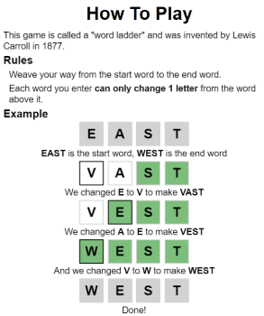
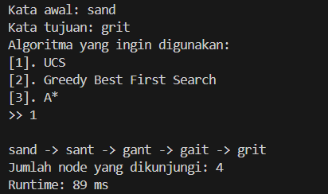

# Penyelesaian Permainan *Word Ladder* Menggunakan Algoritma UCS, *Greedy Best First Search*, dan A*
- Program ini akan menerima masukan dua kata, yaitu *start word* dan *end word* serta algoritma yang ingin digunakan, kemudian mengembalikan rute yang digunakan, jumlah *node* yang dikunjungi, dan waktu eksekusi program.

## Table of Contents
* [General Info](#general-information)
* [Technologies Used](#technologies-used)
* [Features](#features)
* [Screenshots](#screenshots)
* [Setup](#setup)
* [Usage](#usage)
* [Project Status](#project-status)
* [Acknowledgements](#acknowledgements)
* [Contact](#contact)

## General Information
- Program ini dibuat untuk menyelesaikan tugas kecil 3 IF2211 Strategi Algoritma.
- *Word Ladder* merupakan sebuah permainan dimana pemain harus menemukan rantai kata yang dapat menghubungkan *start word* dengan *end word*, tiap kata yang berdekatan dalam rantai kata hanya boleh berbeda satu huruf dan harus merupakan kata yang *valid* dalam bahasa Inggris.  

## Technologies Used
- java version "20.0.2" 2023-07-18
- Java(TM) SE Runtime Environment (build 20.0.2+9-78)
- Java HotSpot(TM) 64-Bit Server VM (build 20.0.2+9-78, mixed mode, sharing)

## Features
- Penyelesaian *Word Ladder* dengan Algoritma UCS.
- Penyelesaian *Word Ladder* dengan Algoritma *Greedy Best First Search*.
- Penyelesaian *Word Ladder* dengan Algoritma A*.

## Screenshots

## Setup
- Download Java
- Clone repository github (https://github.com/DieroA/Tucil3_13522056.git)

## Usage
- Buka directory "Tucil3_13522056" dalam terminal.
- Jalankan perintah `java -cp bin Main`.
- Masukkan kata awal, kata akhir, dan algoritma yang ingin digunakan.
- Program akan mengulang sampai di-exit atau terdapat masukan yang tidak valid.

## Project Status
Project sudah selesai.

## Acknowledgements
- words.txt didapatkan dari repository https://github.com/dwyl/english-words/tree/master

## Contact
Dibuat oleh:
- Diero Arga Purnama (13522056)  
13522056@std.stei.itb.ac.id